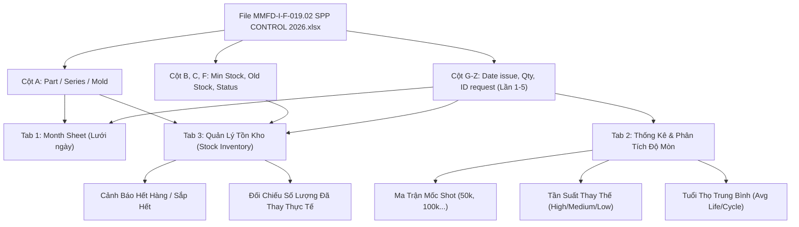

# BÁO CÁO PHÂN TÍCH CẤU TRÚC DỮ LIỆU & QUY CHUẨN KIỂM SOÁT LINH KIỆN KHUÔN
## Biểu mẫu: MMFD-I-F-019.02 SPP CONTROL 2026 (Iriso Electronics Vietnam Co., Ltd.)

---

## 1. TỔNG QUAN TÀI LIỆU
* **Tên biểu mẫu**: `MMFD-I-F-019.02 (27-Apr-26)` - `MOLD PARTS LIST / SPP CONTROL 2026`.
* **Đơn vị ban hành**: Công ty TNHH Iriso Electronics Việt Nam (*Iriso Electronics Vietnam Co., Ltd.*).
* **Mục đích**: Bảng theo dõi và kiểm soát toàn diện xuất - nhập - tồn linh kiện thay thế khuôn dập (Spare Parts Control), xác định mức tồn kho an toàn, cảnh báo nhu cầu đặt mua và ghi nhận nhật ký xuất linh kiện thực tế theo từng tháng.

---

## 2. CẤU TRÚC SHEET TRONG FILE

File gồm **3 Sheet** theo dõi xuyên suốt các tháng trong năm 2026:

| Tên Sheet | Tháng Áp Dụng | Tổng Mã Linh Kiện | Số Dòng Phát Sinh Xuất Thay | Phạm Vi Dữ Liệu (Range) |
| :--- | :---: | :---: | :---: | :---: |
| **`6-2026`** | Tháng 06 / 2026 | **1,291** mã | 57 dòng | `A1:AA3584` |
| **`7-2026`** | Tháng 07 / 2026 | **1,407** mã | 78 dòng | `A1:AA3584` |
| **`8-2026`** | Tháng 08 / 2026 | **1,359** mã | 15 dòng | `A1:AA3584` |

---

## 3. CẤU TRÚC TIÊU ĐỀ & CÁC CỘT DỮ LIỆU (TỪ CỘT A ĐẾN Z)

Bảng tính được thiết kế theo cấu trúc phân tầng 2 tầng tiêu đề (Dòng 6 & Dòng 7):

```
Dòng 2: Iriso Electronics Vietnam co., Ltd. | MOLD PARTS LIST
Dòng 3: MMFD-I-F-019.02 (27-Apr-26)
Dòng 5: MONTH/THÁNG : [Tháng/Năm]
Dòng 6: [PART] | [STANDARD] | [Tồn cũ] | [Số lượng mua] | [Ngày nhận] | [GHI CHÚ] | [LẤY LẦN 1] | [LẤY LẦN 2] | [LẤY LẦN 3] | [LẤY LẦN 4] | [LẤY LẦN 5]
Dòng 7: [NO]   |            |          |                |             | [Trạng thái]| Qty|ID|Date|Tồn| Qty|ID|Date|Tồn| Qty|ID|Date|Tồn| Qty|ID|Date|Tồn| Qty|ID|Date|Tồn
Dòng 8+: [Dữ liệu chi tiết từng linh kiện]
```

### Chi tiết các cột:

| Vị trí | Ký hiệu | Tên Cột (Header) | Quy cách & Kiểu dữ liệu | Ý nghĩa chức năng |
| :---: | :---: | :--- | :--- | :--- |
| **1** | **A** | `PART / NO` | `String` dạng `[PartName]/[Series]/[DieSet]` | Mã định danh ghép duy nhất của linh kiện trên từng khuôn (Ví dụ: `CF01A/9615S/FA06001`, `309A/11603S/IR-362`, `203A/9637S/IR-324`). |
| **2** | **B** | `STANDARD` | `Integer` | **Mức tồn kho an toàn tối thiểu (Min Stock)** quy định cho mã linh kiện đó. |
| **3** | **C** | `Tồn cũ (Old stock)` | `Integer` | **Số lượng tồn kho thực tế đầu kỳ** (chuyển từ cuối tháng trước sang). |
| **4** | **D** | `Số lượng mua` | `Integer` | Số lượng linh kiện nhập kho mới mua về trong tháng. |
| **5** | **E** | `Ngày nhận` | `String / Date` | Ngày nhận hàng nhập kho từ nhà cung cấp. |
| **6** | **F** | `GHI CHÚ / Trạng thái` | `String` (`NO NEED` / `NEED ORDER`) | Cảnh báo trạng thái đặt hàng:<br>• `NO NEED`: Tồn kho $\ge \text{Standard}$ (đủ hàng).<br>• `NEED ORDER`: Tồn kho $< \text{Standard}$ (cần đặt mua ngay). |
| **7 - 10** | **G - J** | **LẤY LINH KIỆN LẦN 1** | Nhóm 4 cột chi tiết: | Xuất linh kiện thay thế lần 1 trong tháng: |
| | G | `Số lượng (Qty)` | `Integer` | Số lượng linh kiện xuất kho để thay vào khuôn. |
| | H | `ID request` | `String / Integer` | Mã số phiếu yêu cầu hoặc ID nhân viên đề xuất thay thế. |
| | I | `Date issue` | `Integer` (1 - 31) | Ngày xuất linh kiện trong tháng. |
| | J | `Tồn` | `Integer` | Số lượng tồn kho còn lại sau khi xuất lần 1 ($\text{Tồn} = \text{Tồn cũ} + \text{Mua} - \text{Qty 1}$). |
| **11 - 14** | **K - N** | **LẤY LINH KIỆN LẦN 2** | `Qty` \| `ID request` \| `Date issue` \| `Tồn` | Xuất linh kiện thay thế lần 2 trong tháng. |
| **15 - 18** | **O - R** | **LẤY LINH KIỆN LẦN 3** | `Qty` \| `ID request` \| `Date issue` \| `Tồn` | Xuất linh kiện thay thế lần 3 trong tháng. |
| **19 - 22** | **S - V** | **LẤY LINH KIỆN LẦN 4** | `Qty` \| `ID request` \| `Date issue` \| `Tồn` | Xuất linh kiện thay thế lần 4 trong tháng. |
| **23 - 26** | **W - Z** | **LẤY LINH KIỆN LẦN 5** | `Qty` \| `ID request` \| `Date issue` \| `Tồn` | Xuất linh kiện thay thế lần 5 trong tháng. |

---

## 4. PHÂN TÍCH QUY LUẬT XUẤT NHẬP TỒN & DỮ LIỆU THỰC TẾ

### A. Quy luật tính toán tồn kho liên hoàn
$$\text{Tồn kho cuối kỳ} = \text{Tồn cũ (Old stock)} + \text{Số lượng mua} - \sum_{i=1}^{5} \text{Qty xuất lần } i$$
$$\text{Trạng thái đặt hàng} = \begin{cases} \text{NO NEED}, & \text{khi } \text{Tồn} \ge \text{STANDARD} \\ \text{NEED ORDER}, & \text{khi } \text{Tồn} < \text{STANDARD} \end{cases}$$

### B. Mẫu dữ liệu xuất linh kiện tiêu biểu đã ghi nhận:
1. **Khuôn `IR-324` (Series `9637S`)**:
   - `Part 310`: Xuất 8 cái (ngày 04/06), tiếp tục xuất 8 cái (ngày 06/06), xuất 8 cái (ngày 03/07), xuất 8 cái (ngày 17/07).
   - `Part 203A`: Xuất 3 cái (ngày 23/06), xuất 4 cái (ngày 17/07).
   - `Part 203B`: Xuất 2 cái (ngày 23/06), xuất 1 cái (ngày 02/07), xuất 1 cái (ngày 17/07), xuất 1 cái (ngày 19/07).
2. **Khuôn `IR-362` (Series `11603S`)**:
   - `Part 309A`: Xuất 26 cái (ngày 03/08, ID 4771).
   - `Part 309B`: Xuất 34 cái (ngày 03/08, ID 4771).
   - `Part 309C`: Xuất 10 cái (ngày 03/08, ID 4771).
   - `Part 309D`: Xuất 10 cái (ngày 03/08, ID 4771).
3. **Khuôn `IR-356` (Series `13056B`)**:
   - `Part 322A` & `Part 322B`: Xuất thay định kỳ ngày 03/06 (ID 5486).

---

## 5. BẢN ĐỒ TÍCH HỢP VÀO ỨNG DỤNG MOLD LIFE SPAN (COMPONENT WEAR APP)

Dữ liệu từ biểu mẫu MMFD-I-F-019.02 ánh xạ trực tiếp và hoàn hảo vào 3 Tab chức năng của ứng dụng:



### Ánh xạ chi tiết:
1. **Tab 1: `📅 Month Sheet` (Theo dõi ma trận ngày)**:
   - Dữ liệu `Date issue` + `Qty` được điền trực tiếp vào ô ngày tương ứng trong tháng.
2. **Tab 2: `📊 Thống Kê & Phân Tích Độ Mòn (Statistic & Analyst)`**:
   - Dữ liệu ngày xuất thay thế kết hợp với sản lượng dập (Shoot Data) để xác định chính xác:
     - **Mốc Shot bắt đầu mòn / phải thay** (50k, 100k, 150k, 200k, 250k...).
     - **Tần suất thay thế** và **Tuổi thọ trung bình theo chu kỳ**.
3. **Tab 3: `📦 Quản Lý Tồn Kho (Stock)`**:
   - `STANDARD` $\to$ Cột **Mức Min An Toàn**.
   - `Old stock` / `Tồn` $\to$ Cột **Tồn Kho Hiện Tại**.
   - Tổng $\sum \text{Qty}$ $\to$ Cột **Đã Thay (Used)**.
   - `GHI CHÚ` $\to$ Hệ thống cảnh báo tự động `🟢 An Toàn` / `🟡 Sắp Hết` / `🔴 Hết Hàng`.

---

## 6. KẾT LUẬN & ĐỀ XUẤT
* Biểu mẫu `MMFD-I-F-019.02` có cấu trúc dữ liệu rất chuẩn hóa, đầy đủ định danh linh kiện `Part/Series/Mold`, phân định rõ ràng giữa mức an toàn, tồn kho và các đợt phát sinh thay thế.
* Toàn bộ dữ liệu này tương thích 100% với hệ thống `Mold Life Span v2.0` hiện tại, cho phép tự động hóa hoàn toàn quy trình phân tích độ mòn và quản trị tồn kho linh kiện khuôn dập.
